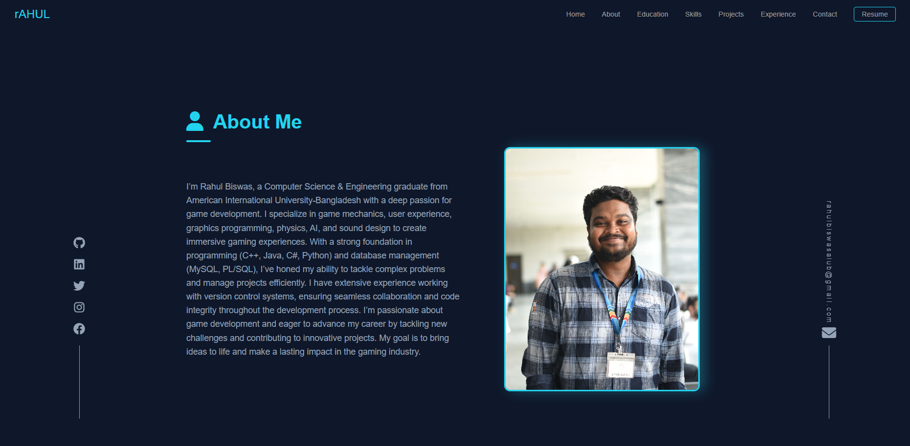
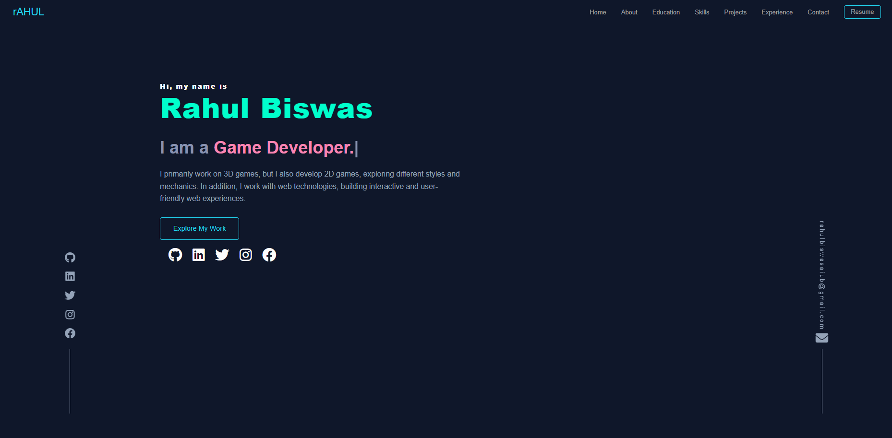
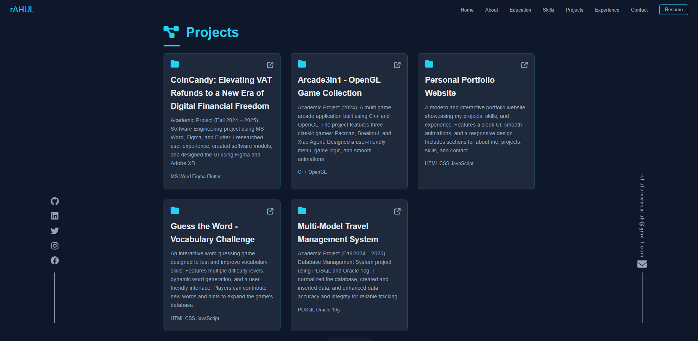

# Personal Portfolio Website



## 🚀 Overview
This is a **professional portfolio website** built using **HTML, CSS, and JavaScript**. It showcases my skills, projects, and experience in a modern, responsive, and visually appealing manner.

## ✨ Features
- **Dark Theme with a Hacker-Corporate Aesthetic** 🖤
- **Smart and Modern Navigation Menu** 📌
- **Smooth Animations and Transitions** 🎨
- **FontAwesome Icons for Enhanced UI** 🔥

## 🛠️ Technologies Used
- **HTML** - Structuring the webpage
- **CSS** - Styling and layout
- **JavaScript** - Interactive elements (e.g., self-typing text, mute button, smooth scrolling)

## 📂 Installation & Usage
1. **Clone this repository:**
   ```sh
   git clone https://github.com/rahulxiao/rahul.git
   ```
2. **Navigate to the project directory:**
   ```sh
   cd rahul
   ```
3. **Open `index.html` in a web browser.**

## 📁 Project Structure
```
rahul/
│-- Assets/
│   ├── about_me.png
│   ├── image.png
│   ├── projects.png
│-- index.html
│-- styles.css
│-- script.js
│-- favicon.png
│-- favicon.ico
│-- rahul_biswas.JPG
│-- README.md
```

## 🎨 Customization
- **Profile Image:** Replace `Assets/profile.png` with your own.
- **Theme Customization:** Modify `styles.css` to adjust colors, fonts, and layouts.
- **Interactive Features:** Edit `script.js` to change animations or add new interactions.

## 📸 Screenshots
### 🔹 Home Page


### 🔹 Projects Section


### 🔹 About Me 


## 🏆 Credits
- **Google Fonts** - Typography
- **FontAwesome** - Icons
- **Open Source Libraries** - For animations and effects

## 📜 License
This project is open-source and available under the **MIT License**.


